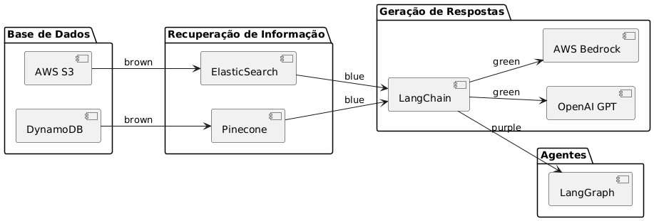

# Documentação do Projeto: Generative AI com RAG e Integrações Modernas

## **Visão Geral**
Este projeto implementa um sistema de Recuperação de Informação + Geração de Respostas (RAG) utilizando ferramentas modernas como **FAISS**, **SentenceTransformers** e **Python**. O objetivo é criar um pipeline funcional que combine a indexação de embeddings com a geração de respostas relevantes.

---

## **Estrutura do Repositório**

```plaintext
generative-ai-rag-project/
├── README.md
├── docs/
│   ├── introduction.md
│   ├── architecture.md
│   ├── diagrams/
│   │   ├── arquitetura.puml
│   │   ├── arquitetura.png
│   ├── tools-and-cases.md
├── src/
│   ├── data_processing/
│   │   └── preprocess.py
│   ├── models/
│   ├── pipelines/
│   └── agents/
├── notebooks/
│   ├── exploration.ipynb
│   ├── training.ipynb
│   └── deployment.ipynb
├── tests/
├── requirements.txt
└── LICENSE
```

---

## **Arquitetura**



### Componentes Principais:

1. **Base de Dados**:
   - AWS S3, DynamoDB: Armazenamento de dados.

2. **Recuperação de Informação**:
   - ElasticSearch, Pinecone: Sistemas para indexação e busca de embeddings.

3. **Geração de Respostas**:
   - AWS Bedrock, OpenAI GPT: Modelos generativos para respostas baseadas nos dados recuperados.

4. **Agentes Inteligentes**:
   - LangChain, LangGraph: Criação de agentes personalizados.

---

## **Desenvolvimento Realizado**

### **1. Pré-processamento dos Dados**
- Base de dados utilizada: **Natural Questions** (versão simplificada).
- Objetivo: Converter a base JSONL para um formato CSV mais acessível.
- Ferramentas: **Pandas**.

**Etapas Executadas:**
1. Leitura dos arquivos `.jsonl`.
2. Extração das colunas principais (`question` e `answer`).
3. Geração de arquivos processados:
   - `cleaned_dataset_train.csv`
   - `cleaned_dataset_dev.csv`

**Localização do Código:** `src/data_processing/preprocess.py`

---

### **2. Análise Exploratória**
- Arquivo: `notebooks/exploration.ipynb`
- Ferramentas: **Pandas**, **Matplotlib**.

**Resultados:**
- Distribuição das respostas (`YES`, `NO`).
- Validação de integridade dos datasets gerados.

---

### **3. Geração de Embeddings**
- Biblioteca: **SentenceTransformers**.
- Modelo Utilizado: `all-MiniLM-L6-v2`.

**Etapas:**
1. Carregamento do dataset processado.
2. Geração de embeddings para as perguntas.
3. Verificação do tamanho e formato dos embeddings gerados.

---

### **4. Indexação e Busca com FAISS**
- Ferramenta: **FAISS** (Facebook AI Similarity Search).

**Etapas:**
1. Configuração do índice FAISS para distâncias Euclidianas.
2. Adição dos embeddings ao índice.
3. Implementação de um exemplo de busca com queries específicas:
   - Exemplo: "What is the capital of France?"
   - Retorno: Embeddings mais similares no índice.

---

## **Próximos Passos**

1. **Integração do Pipeline de Recuperação e Geração**:
   - Combinar a busca FAISS com a geração de respostas usando modelos generativos (e.g., OpenAI GPT).

2. **Testes Automatizados**:
   - Criar casos de teste para garantir a integridade do pipeline.

3. **Documentação Adicional**:
   - Adicionar detalhes sobre configurações avançadas (e.g., ajuste de parâmetros do FAISS).

---

## **Tecnologias Utilizadas**
- **Python**
- **Pandas**
- **Matplotlib**
- **SentenceTransformers**
- **FAISS**

---

## **Como Executar o Projeto**

### Pré-requisitos
- Python 3.8+
- Instalar as dependências:
  ```bash
  pip install -r requirements.txt
  ```

### Passos
1. **Pré-processar os Dados**:
   ```bash
   python src/data_processing/preprocess.py
   ```
2. **Executar a Análise Exploratória**:
   - Abrir o notebook `notebooks/exploration.ipynb`.

3. **Gerar Embeddings e Configurar FAISS**:
   - Executar o script atualizado no mesmo notebook.

---
